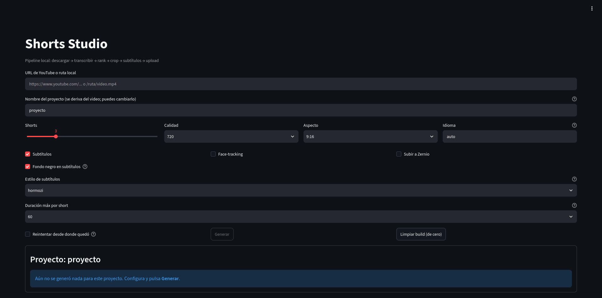
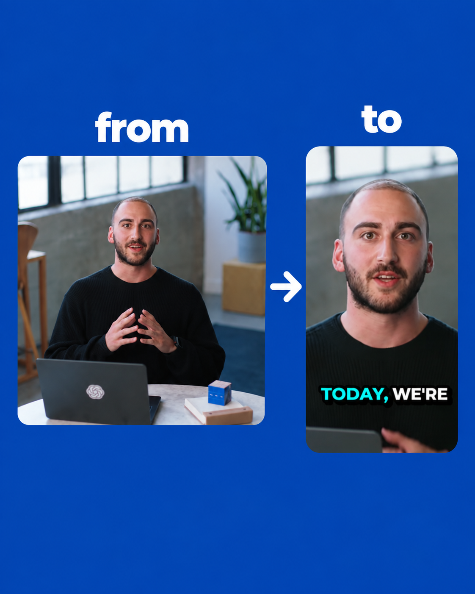

# Shorts Studio — AI YouTube Shorts Generator

Open-source alternative to **Opus Clip, Vidyo.ai, Klap, SubMagic and 2short.ai**. Drop in any long-form YouTube video and get back ranked, viral-ready 9:16 shorts — running entirely on your own machine, with no per-clip credits and no watermarks.

Pipeline: **download → transcribe → rank highlights → vertical crop → animated subtitles → upload**

## Demo





## Features

- **Two modes**
  - `api` — hosted transcription + LLM ranking via MuAPI
  - `local` — everything on your machine: faster-whisper, your own LLM provider (OpenAI / Gemini / DeepSeek), ffmpeg
- **Streamlit GUI** (`app.py`) — runs detached in a subprocess, writes progress to disk, survives page refreshes
- **6 animated caption styles** — hormozi / mrbeast / karaoke / minimal / bounce / classic, with word-level timestamps and libass layout
- **Face-tracking** vertical crop, sentence-aware clip length (15 / 30 / 60s)
- **Resume** — restart from the last cached stage after a crash
- **Upload** finished shorts straight to YouTube or Instagram via Zernio
- Every short ships with a **virality score (0–100)**, a hook sentence, and the reason it should perform

## Quick start

```bash
git clone https://github.com/Ghavvvo/AI-Youtube-Shorts-Generator.git
cd AI-Youtube-Shorts-Generator
python -m venv .venv && source .venv/bin/activate
pip install -r requirements-local.txt      # local mode (faster-whisper + ffmpeg)
pip install -r requirements.txt            # API mode only (MuAPI)
```

### 1. Configure `.env`

Copy `.env.example` and fill in what your mode needs:

| Mode | Required |
|------|----------|
| `api` | `MUAPI_API_KEY` |
| `local` | `LLM_PROVIDER` + `OPENAI_API_KEY` (or `GEMINI_API_KEY`, or DeepSeek via `OPENAI_BASE_URL`) |

### 2. GUI (recommended)

```bash
streamlit run app.py
```

### 3. CLI

```bash
python main.py "https://www.youtube.com/watch?v=..." \
    --mode local \
    --num-clips 5 \
    --style mrbeast \
    --max-clip-secs 30
```

Output:

```
#1  score=92  124.3s → 187.6s
     title:  The one mistake that cost me $50K
     hook:   Nobody talks about this, but it killed my first startup...
     clip:   output/<project>/short_1.mp4
```

## CLI reference

| Flag | Default | Notes |
|------|---------|-------|
| `url` | — | YouTube URL, `file://` URL, or local path |
| `--mode` | `api` | `api` (MuAPI) or `local` (faster-whisper + your LLM) |
| `--num-clips` | `3` | How many shorts to render |
| `--aspect-ratio` | `9:16` | Also `1:1`, `4:5` |
| `--format` | `720` | Source download resolution: 360/480/720/1080 |
| `--language` | auto | Force Whisper language code (e.g. `en`) |
| `--output-json` | — | Dump the full result (transcript + candidates + clips) |
| `--no-subtitles` | — | Don't burn subtitles (local mode) |
| `--track-face` | — | Face-tracking vertical crop (local mode) |
| `--upload` | — | Upload finished shorts to Zernio (local mode) |
| `--resume` | — | Resume from last cached stage (local mode) |
| `--style` | `hormozi` | Subtitle style: hormozi/mrbeast/karaoke/minimal/bounce/classic |
| `--max-clip-secs` | `60` | Max clip length: 15/30/60 (local mode) |
| `--no-bg` | — | Subtitles without black background/glow |

## How it works

1. **Download** — the source video at the requested resolution
2. **Transcribe** — Whisper returns timestamped segments (word-level in local mode)
3. **Classify** — the LLM tags content type (podcast / interview / tutorial / vlog…) to tune ranking
4. **Chunk** — long videos are split into overlapping windows so cross-boundary highlights aren't missed
5. **Rank** — every candidate scored 0–100 against a virality framework: hook / emotional peak / opinion bomb / revelation / conflict / quotable / story peak / practical value
6. **Dedupe** — overlapping candidates collapse, higher score wins
7. **Crop** — each highlight rendered vertically (auto face-tracking)
8. **Subtitles + upload** — word-animated captions burned in; optional Zernio upload

## Project layout

```
shorts_generator/
├── pipeline.py        # orchestration
├── downloader.py      # YouTube / URL download
├── transcriber.py     # MuAPI Whisper transcription
├── highlights.py      # virality ranking (LLM)
├── clipper.py         # vertical auto-crop
└── local/             # --mode local implementation
    ├── transcriber.py # faster-whisper (word-level)
    ├── subtitles.py   # animated ASS captions (pysubs2)
    ├── caption_styles.py  # the 6 style presets
    ├── clipper.py     # face-tracking crop
    └── uploader.py    # Zernio upload
app.py                 # Streamlit GUI
main.py                # CLI entry point
```

## Based on

Fork of [SamurAIGPT/AI-Youtube-Shorts-Generator](https://github.com/SamurAIGPT/AI-Youtube-Shorts-Generator)
and its continuation [Anil-matcha/AI-Youtube-Shorts-Generator](https://github.com/Anil-matcha/AI-Youtube-Shorts-Generator), both MIT licensed.

## Credits

- **Subtitles & caption presets** — ported from [nicolaigaina/ai-video-captions](https://github.com/nicolaigaina/ai-video-captions) (MIT, © 2026 AutoShorts)
- **Transcription** — [Whisper](https://github.com/openai/whisper) via faster-whisper / MuAPI
- **Upload** — Zernio API

## License

[MIT](LICENSE)